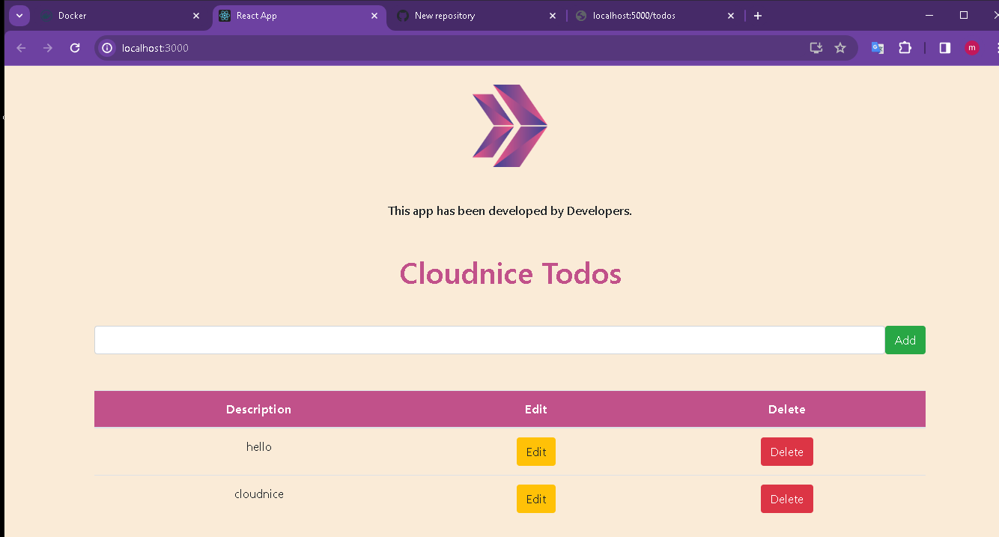

   # Dockerized Node.js and React App with PostgreSQL

This project includes a Docker-based application with a PostgreSQL database, a Node.js server application, and a React client application.

## Running the Project

This project is created for Docker Desktop. To run it in a different environment, you need to modify the server connection points in the `.env` files.

1. Open a Terminal or Command Prompt.
2. Navigate to the directory where the `docker-compose.yaml` file is located.
3. Run the following command:

    ```bash
    docker-compose up
    ```

4. The applications will start, and you can access the client application at [http://localhost:3000](http://localhost:3000) and the server application at [http://localhost:5000](http://localhost:5000).

## Project Structure

The project includes the following directories:

- **client**: Client-side application.
- **database**: Docker files for PostgreSQL database and an initial SQL script.
- **server**: Server-side application.

## Docker Compose

The `docker-compose.yaml` file defines the services, networks, and environment variables in the project.





